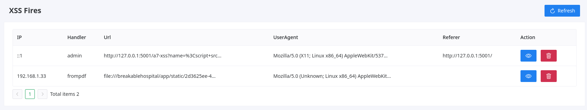
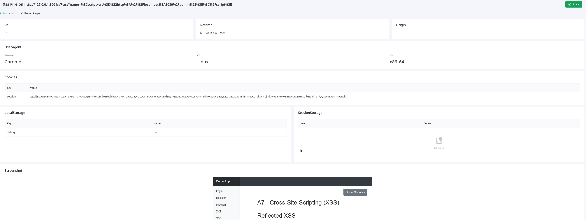
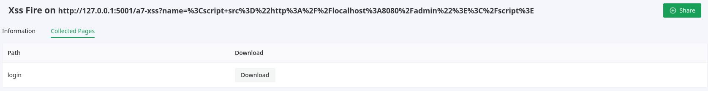
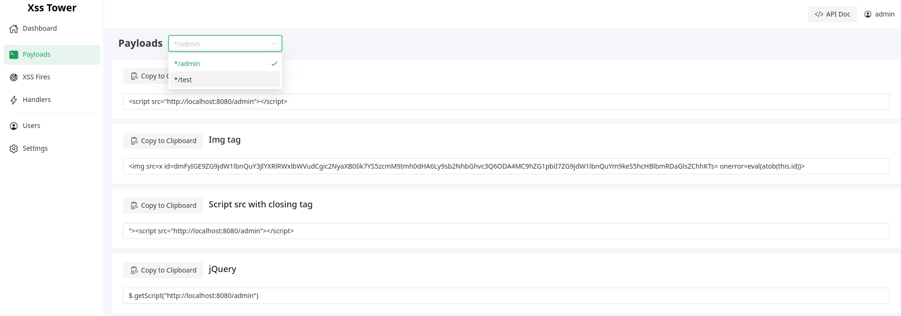
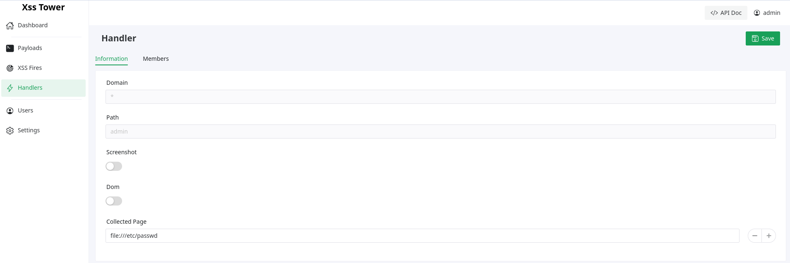
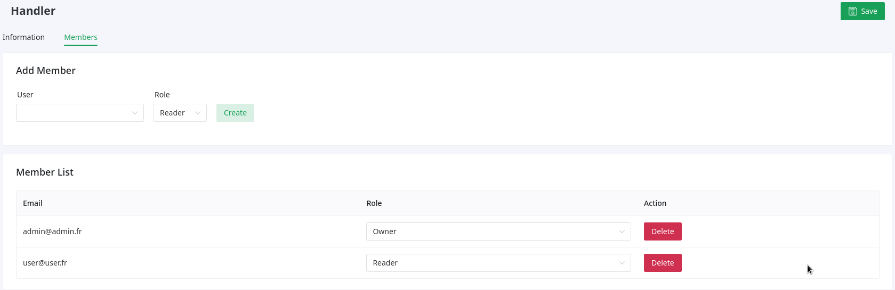
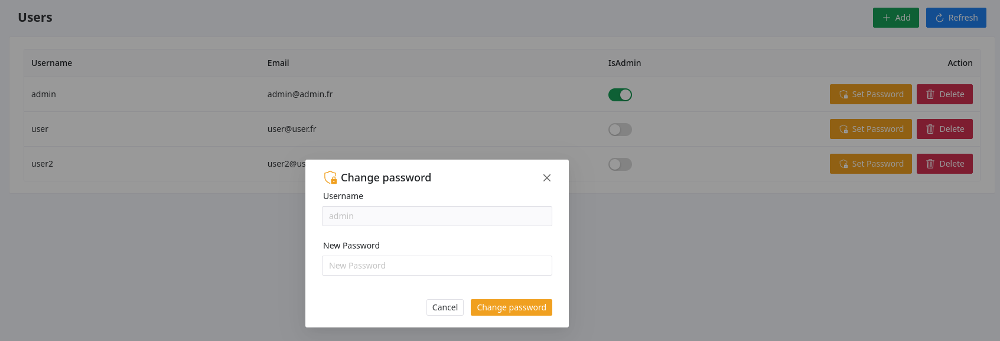

# XSS Tower

XSS Tower is an open-source project that enables users to exploit Blind Cross-Site Scripting (XSS) vulnerabilities. This tool allows users to add new handlers to receive XSS payloads and share it with other users. With XSS Tower, you can efficiently identify and exploit XSS vulnerabilities, aiding in web application security testing. This tool is inspired by others such as XSSHunter and ezXSS. 

- [Features](#features)
- [Installation](#installation)
- [Screenshots](#screenshots)
- [Contributing](#contributing)
- [License](#license)


## Features

- Exploit blind XSS vulnerabilities
- Add handlers to receive fires upon payload execution
- Share handlers  with other users
- Allow public access to XSS Fire
- Exfiltrate pages or local file
- Disable DOM/Screenshot 
- Save fire even if the payload failed to execute
## Installation

### From docker

```
docker run -d -p 8080:8080 thomasfady/xsstower
```

### From Go

```
go install -v github.com/thomasfady/xsstower@latest
```

### From source

```sh
cd client
npm install
npm run build
cd -
cp -r client/dist/* app
go mod tidy
CGO_ENABLED=0 GOOS=linux go build -o xsstower -ldflags="-s -w" main.go
```

## Screenshots

<details> 
<summary>XSS Fires</summary>



</details>

<details> 
<summary>XSS Fires Details</summary>



</details>

<details> 
<summary>XSS Fires Collected Pages / Files</summary>



</details>

<details> 
<summary>Payloads</summary>



</details>

<details> 
<summary>Handler Information</summary>



</details>

<details> 
<summary>Handler Members</summary>



</details>

<details> 
<summary>Admin User management</summary>



</details>


## TODO

- [ ] Registration
- [X] Database config
- [X] Change password form
- [ ] 2FA
- [ ] Notification system
- [ ] Documentation
- [X] UI Fixes
- [ ] Add tests


## Contributing

Contributions to XSS Tower are always welcome! If you find a bug or have suggestions for new features, please open an issue on the GitHub repository. If you would like to contribute code, fork the repository and submit a pull request with your changes.

## License

XSS Tower is open-source software released under the [GPLv3](https://www.gnu.org/licenses/gpl-3.0.fr.html). See the [LICENSE](LICENSE) file for more information.